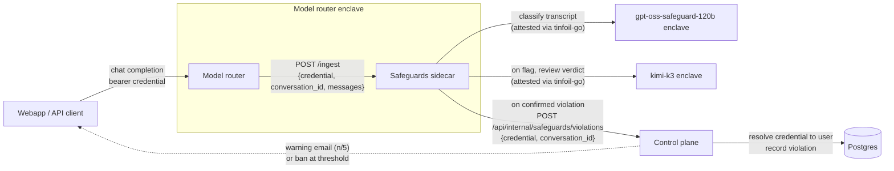
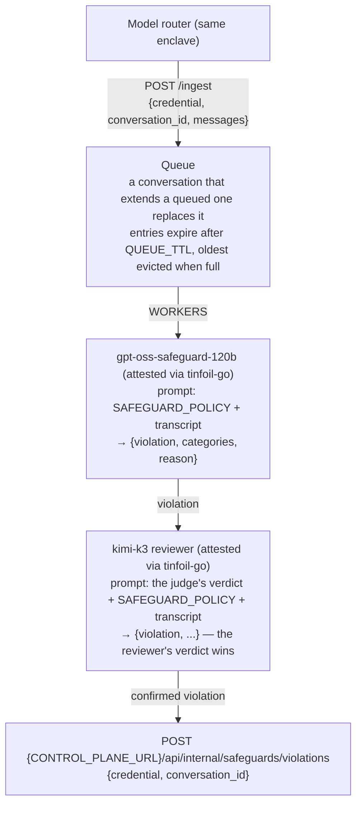

# Confidential Safeguards

An Acceptable Use Policy monitor that runs as a sidecar container inside the model router's enclave. The router submits each completed conversation turn over the enclave's private network; the sidecar classifies it with `gpt-oss-safeguard-120b`, and every flag is second-guessed by a reviewer model (`kimi-k3`) that is shown the judge's verdict and the same policy. Confirmed violations are reported to the control plane (Tinfoil controlled), which warns and eventually bans the account.

Surfaces:

- `POST /ingest` - accept a conversation for classification
- `GET /health` - health check

This service has no authentication of its own: it is only reachable from containers in the same enclave, and the enclave's attestation covers the sidecar image and its configuration.

## Architecture



The router forwards the user's own credential, so the control plane can verify who the user is (JWT signature or API key lookup) without trusting the sidecar. Message content is sent only to the attested model enclaves (both the first pass and second pass model); the report to the control plane carries neither content, nor the violation categories, nor either model's reasoning — only the binary fact that a violation occurred. The report body sent to the Tinfoil control plane is defined by the two-field `Violation` struct in `controlplane.go` (credential, conversation id) and serialized directly from it, so nothing else can appear on the wire.

Inside the sidecar:



Conversations are held in memory only. Each turn is chain-hashed with the caller's credential and conversation id as salt, so the hash of a conversation at turn `n` is a prefix hash of the same conversation at turn `n+1`; the queue uses this to replace a stale entry with its newer turn. The sidecar keeps no other state: every confirmed flag is reported, and the control plane uses `conversation_id` (when the client supplied one) to avoid counting the same conversation twice. The credential (API key or inference JWT) is forwarded as-is; the control plane resolves it to a user. Neither message content, nor the violation categories, nor the models' reasoning leaves the enclave or is logged.

## Ingest

```json
POST /ingest

{
  "credential": "<bearer the user presented to the router>",
  "conversation_id": "<optional client chat id>",
  "messages": [
    {"role": "system", "content": "..."},
    {"role": "user", "content": "..."},
    {"role": "assistant", "content": "..."}
  ]
}
```

`messages` uses the OpenAI chat format. Content may be a string, `null`, or an array of parts; non-text parts are replaced with a `[type]` placeholder.

| Status | Meaning                                                                    |
| ------ | -------------------------------------------------------------------------- |
| `202`  | Queued for classification                                                  |
| `400`  | Malformed JSON, trailing data, missing credential, or invalid `messages`   |
| `405`  | Method other than `POST`                                                   |
| `413`  | Body larger than `MAX_REQUEST_BYTES`                                       |

Error responses carry a static message; nothing derived from the request is echoed back.

## Deployment

This repo ships a container image, not an enclave config. Declare it alongside the router in the router's `tinfoil-config.yml`:

```yaml
containers:
  - name: "proxy"
    # ...
    env:
      - SAFEGUARDS_URL: "http://safeguards:8090"

  - name: "safeguards"
    image: "ghcr.io/tinfoilsh/confidential-safeguards@sha256:<digest from the release>"
    restart: always
    networks: [web]
    env:
      - SAFEGUARD_MODEL: "gpt-oss-safeguard-120b"
      - SAFEGUARD_POLICY: |
          <policy prompt>
    secrets:
      - TINFOIL_API_KEY
```

The policy prompt and all tunables live in that config so they are audited alongside the image measurement.

## Configuration

| Variable                   | Default                  | Description                                                                                                                     |
| -------------------------- | ------------------------ | ------------------------------------------------------------------------------------------------------------------------------- |
| `TINFOIL_API_KEY`          | -                        | API key for both the classifier and reviewer models (secret)                                                                    |
| `SAFEGUARD_POLICY`         | -                        | System prompt for the classifier                                                                                                |
| `SAFEGUARD_MODEL`          | `gpt-oss-safeguard-120b` | Classifier model                                                                                                                |
| `SAFEGUARD_REVIEW_MODEL`   | `kimi-k3`                | Reviewer model that second-guesses every flag; its verdict is final                                                             |
| `SAFEGUARD_TIMEOUT`        | `5m`                     | Per-classification timeout (first pass)                                                                                         |
| `SAFEGUARD_REVIEW_TIMEOUT` | `10m`                    | Per-review timeout (second pass; the reviewer reasons at length on hard cases)                                                  |
| `MAX_TRANSCRIPT_BYTES`     | `320000`                 | Transcript cap; oldest turns are dropped first. Sized so dense text (~3 bytes/token) stays near 80% of the model's 131k context |
| `MAX_REQUEST_BYTES`        | `4194304`                | Maximum `/ingest` body size                                                                                                     |
| `QUEUE_TTL`                | `1h`                     | Conversations not classified within this time are dropped                                                                       |
| `QUEUE_MAX_SIZE`           | `10000`                  | Queue capacity                                                                                                                  |
| `WORKERS`                  | `4`                      | Concurrent classifications                                                                                                      |
| `CONTROL_PLANE_URL`        | `https://api.tinfoil.sh` | Control plane base URL                                                                                                          |
| `LISTEN_ADDR`              | `:8090`                  | HTTP listen address                                                                                                             |

## Code map

Everything is one `package main`:

| File              | Role                                                                                                 |
| ----------------- | ---------------------------------------------------------------------------------------------------- |
| `main.go`         | Wires the pieces together, starts the workers and the HTTP server, handles shutdown                  |
| `config.go`       | Reads and validates the environment                                                                  |
| `service.go`      | `/ingest` handler, the worker loop, and the classify -> review -> report pipeline                    |
| `conversation.go` | Turns chat messages into a bounded transcript plus the prefix-hash chain the queue dedupes on        |
| `queue.go`        | In-memory FIFO with prefix replacement, TTL expiry, and capacity eviction                            |
| `verdict.go`      | The `Verdict` type, its strict JSON schema, and the single model request path both passes share      |
| `classifier.go`   | First pass: policy as system prompt, transcript as user prompt                                       |
| `reviewer.go`     | Second pass: the judge's verdict and the policy as system prompt; its verdict is final               |
| `controlplane.go` | Reports a confirmed violation; the `Violation` struct is the entire wire format                      |

## Development

```bash
cp .env.example .env   # fill in secrets and SAFEGUARD_POLICY
set -a; source .env; set +a
go run .
go test -race ./...
```

The tests need no network access: model calls are exercised against an in-process fake of the chat-completions endpoint, and the control plane against an `httptest` server.

## Reporting Vulnerabilities

Please report security vulnerabilities to security@tinfoil.sh.
