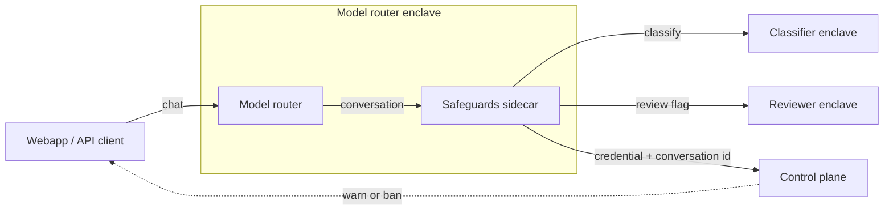

# Confidential Safeguards

Confidential Safeguards checks conversations on Tinfoil's model router against an Acceptable Use Policy, without anyone at Tinfoil ever being able to read them.

## How it works

The service runs as a sidecar inside the same enclave as the model router. After every chat turn:

1. **The router hands the conversation to the sidecar.** The sidecar acknowledges immediately and queues it, so the user never waits on moderation.
2. **A classifier model reads it.** The conversation is sent to `gpt-oss-safeguard-120b`, running in its own attested enclave, with the policy as its instructions. If it sees no violation, the conversation is dropped and that is the end of it.
3. **A second model reviews every flag.** If the classifier flags a violation, an independent reviewer model (`kimi-k3`, also attested) is shown the same conversation, the same policy, and the classifier's reasoning, and decides for itself. The reviewer's verdict is final.
4. **Only confirmed violations are reported.** The sidecar tells the control plane that a violation happened: just the user's credential and a conversation id. The control plane warns the user as they approach the limit and suspends the account if they reach it.

## What makes it confidential

- **Conversations stay inside attested enclaves.** The only places message content ever goes are the classifier and reviewer models, and each connection is verified with Tinfoil's attestation before anything is sent.
- **The report contains almost nothing.** The control plane learns that a violation occurred and who it belongs to. It never sees the messages, which rule was broken, or why the models decided what they did.
- **The sidecar cannot speak for users.** It forwards the credential the user presented to the router, and the control plane verifies that credential itself.
- **Nothing is logged.** No content, no categories, no model reasoning. If a model call fails, the conversation is simply dropped and picked up again on the next turn.
- **The whole setup is auditable.** The image, the policy text, and every setting are declared in the enclave configuration, so they are covered by the same attestation as the router.

The sidecar has no authentication of its own because it is only reachable from other containers inside the enclave.

## Running it

The service ships as a container image. Deploy it next to the router in the router's enclave configuration, point the router at it, and give it the policy text and a Tinfoil API key. Everything else has sensible defaults.

For local development, copy `.env.example` to `.env`, fill it in, and run `go run .`. Tests run with `go test -race ./...` and need no network access.

## Reporting Vulnerabilities

Please report security vulnerabilities to security@tinfoil.sh.
