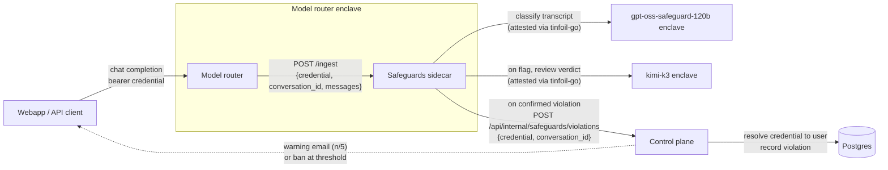

# Confidential Safeguards

An Acceptable Use Policy monitor that runs as a sidecar container inside the model router's enclave. The router submits each completed conversation turn over the enclave's private network; the sidecar classifies it with `gpt-oss-safeguard-120b`, and every flag is second-guessed by a reviewer model (`kimi-k3`) that is shown the judge's verdict and the same policy — the reviewer's verdict is final. Confirmed violations are reported to the control plane, which warns and eventually bans the account.

Surfaces:

- `POST /ingest` - accept a conversation for classification
- `GET /health` - health check

Like the buckets sidecar, this service has no authentication of its own: it is only reachable from containers in the same enclave, and the enclave's attestation covers the sidecar image and its configuration.

## Architecture



The router forwards the user's own credential, so the control plane can verify who the user is (JWT signature or API key lookup) without trusting the sidecar. Message content is sent only to the attested guard- and reviewer-model enclaves; the report to the control plane carries neither content, nor the violation categories, nor either model's reasoning — only the binary fact that a violation occurred (see the `Violation` struct in `controlplane.go`).

Inside the sidecar:

```text
model router (same enclave)
  │  POST http://safeguards:8090/ingest {credential, conversation_id, messages}
  ▼
┌─────────────────────────────────────────────────────────────┐
│ queue                                                       │
│  - a conversation that extends a queued one replaces it     │
│  - entries expire after QUEUE_TTL, oldest evicted when full │
└──────────────────────────┬──────────────────────────────────┘
                           ▼  WORKERS
┌─────────────────────────────────────────────────────────────┐
│ gpt-oss-safeguard-120b (attested via tinfoil-go)            │
│  system: SAFEGUARD_POLICY   user: transcript                │
│  → {"violation": bool, "categories": [...], "reason": ...}  │
└──────────────────────────┬──────────────────────────────────┘
                           ▼  violation
┌─────────────────────────────────────────────────────────────┐
│ kimi-k3 reviewer (attested via tinfoil-go)                  │
│  system: review preamble (the judge's verdict, presented    │
│  as a claim to check) + SAFEGUARD_POLICY   user: transcript │
│  → {"violation": bool, ...} — the reviewer's verdict wins   │
└──────────────────────────┬──────────────────────────────────┘
                           ▼  confirmed violation
     POST {CONTROL_PLANE_URL}/api/internal/safeguards/violations
     {credential, conversation_id}
```

The verdicts (categories, reason) exist only to sharpen the models' judgement and to give the reviewer a claim to check; they are discarded inside the enclave. A review error fails open: the conversation is dropped, not reported.

Conversations are held in memory only. Each turn is chain-hashed with the caller's credential and conversation id as salt, so the hash of a conversation at turn `n` is a prefix hash of the same conversation at turn `n+1`; the queue uses this to replace a stale entry with its newer turn. The sidecar keeps no other state: every reviewer-confirmed flag is reported, and the control plane uses `conversation_id` (when the client supplied one) to avoid counting the same conversation twice. The credential (API key or inference JWT) is forwarded as-is; the control plane resolves it to a user. Neither message content, nor the violation categories, nor the models' reasoning leaves the enclave or is logged.

## Ingest

```json
POST /ingest

{
  "credential": "<bearer the user presented to the router>",
  "conversation_id": "<optional client chat id>",
  "messages": [
    {"role": "system", "content": "..."},
    {"role": "user", "content": "..."},
    {"role": "assistant", "content": "..."}
  ]
}
```

`messages` uses the OpenAI chat format. Content may be a string or an array of parts; non-text parts are replaced with a `[type]` placeholder. Responds `202 Accepted`.

## Deployment

This repo ships a container image, not an enclave config. Declare it alongside the router in the router's `tinfoil-config.yml`:

```yaml
containers:
  - name: "proxy"
    # ...
    env:
      - SAFEGUARDS_URL: "http://safeguards:8090"

  - name: "safeguards"
    image: "ghcr.io/tinfoilsh/confidential-safeguards@sha256:<digest from the release>"
    restart: always
    networks: [web]
    env:
      - SAFEGUARD_MODEL: "gpt-oss-safeguard-120b"
      - SAFEGUARD_POLICY: |
          <policy prompt>
    secrets:
      - TINFOIL_API_KEY
```

The policy prompt and all tunables live in that config so they are audited alongside the image measurement.

## Configuration

| Variable               | Default                  | Description                                               |
| ---------------------- | ------------------------ | --------------------------------------------------------- |
| `TINFOIL_API_KEY`      | -                        | API key for the safeguard model (secret)                  |
| `SAFEGUARD_POLICY`     | -                        | System prompt for the classifier                          |
| `SAFEGUARD_MODEL`      | `gpt-oss-safeguard-120b` | Classifier model                                          |
| `SAFEGUARD_REVIEW_MODEL` | `kimi-k3`              | Reviewer model that second-guesses every flag; its verdict is final |
| `SAFEGUARD_TIMEOUT`    | `5m`                     | Per-classification timeout                                |
| `MAX_TRANSCRIPT_BYTES` | `320000`                 | Transcript cap; oldest turns are dropped first. Sized so dense text (~3 bytes/token) stays near 80% of the model's 131k context |
| `MAX_REQUEST_BYTES`    | `4194304`                | Maximum `/ingest` body size                               |
| `QUEUE_TTL`            | `1h`                     | Conversations not classified within this time are dropped |
| `QUEUE_MAX_SIZE`       | `10000`                  | Queue capacity                                            |
| `WORKERS`              | `4`                      | Concurrent classifications                                |
| `CONTROL_PLANE_URL`    | `https://api.tinfoil.sh` | Control plane base URL                                    |
| `LISTEN_ADDR`          | `:8090`                  | HTTP listen address                                       |

## Development

```bash
cp .env.example .env   # fill in secrets and SAFEGUARD_POLICY
set -a; source .env; set +a
go run . -v
go test -race ./...
```

## Reporting Vulnerabilities

Please report security vulnerabilities to security@tinfoil.sh.
